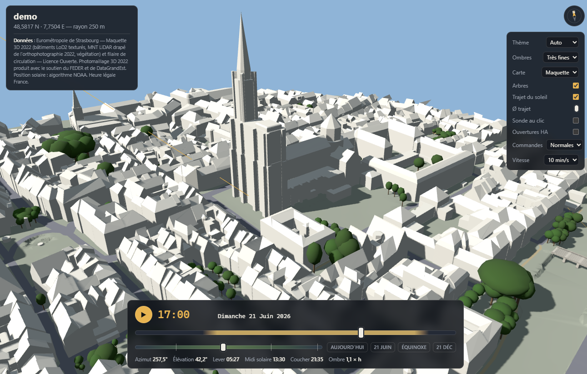

# Sun Shading

**Which of your windows is the sun actually reaching, right now?**

Sun Shading answers that from the real geometry around your home — the
neighbouring buildings, the terrain, the trees, your own roof and its dormers
— and turns the answer into a plain `binary_sensor` your cover automations can
use. It is built for the [Strasbourg
Eurométropole](https://data.strasbourg.eu) open data, and only works there
(see [Coverage](#coverage)).

An azimuth window says "the sun is on this façade between 195° and 359°". That
is a guess: it ignores the building across the street, the roof overhang above
the window, and the lime tree that is bare in March and opaque in July. Sun
Shading computes, for **each opening**, the band of solar elevations that
actually reach it, azimuth by azimuth — a *horizon mask* — by ray-tracing the
real 3D model of the neighbourhood.



## What you get

- A **sidebar panel**: a 3D map of your neighbourhood with shadows at any date
  and time, a sun path, and a probe. Click a window, and it counts the direct
  sun on it minute by minute.
- One **`binary_sensor` per opening**: `on` when the sun reaches that window
  right now. With real attributes — `elevation_min`, `elevation_max`,
  `margin`, `foliage`, `cover`, `point`, `normal`.
- **No YAML, no copy-paste.** Openings are defined by clicking in the map; the
  page publishes the mask into Home Assistant itself.
- Feeds the `shading_custom_sensor` input of the [Cover Control Automation
  blueprint](https://github.com/hvorragend/ha-blueprints), which expects
  exactly this: a strictly binary state.

## Install

1. HACS → three-dot menu → **Custom repositories** → add
   `https://github.com/Zanuuu/ha-sun-shading`, category **Integration**.
2. Install, then **restart Home Assistant** (a custom component is not loaded
   hot).
3. Settings → Devices & Services → **Add integration** → *Sun Shading*.

The config flow offers two paths.

### Build a zone from coordinates

Position and radius are prefilled from your Home Assistant location. A summary
screen then tells you, **before anything starts**: how many 3D tiles will be
read, how many gigabytes will be downloaded, how much disk the result takes,
and an estimated duration **on your machine** (the flow times a short
arithmetic loop — a Raspberry Pi is five to ten times slower than a desktop).

The entry is created immediately. The build runs in the background, in a
separate process; follow it on the *build state* sensor or on the panel
itself. Orders of magnitude, measured on a dense city centre:

| Displayed radius | Tiles | Download | Produced data | Time (desktop) |
|---|---|---|---|---|
| 500 m | ~9 | ~1 GB | ~6 MB | ~2 min |
| 1000 m | ~29 | ~3 GB | ~25 MB | ~7 min |
| 1500 m | ~60 | ~6 GB | ~55 MB | ~15 min |

Downloaded tiles are kept in `config/sun_shading/cache/` and shared between
zones: rebuilding costs no download. Delete that folder to reclaim the space —
it is only needed to rebuild.

An **Advanced** section (collapsed) exposes the Photo 3D mode
(photogrammetric mesh: about 1 GB and 20-30 minutes more, and 370 MB of
graphics memory in the browser), the aerial imagery resolution, the lift
applied to shadows baked into the 2022 imagery, a hand-modelled roof in OBJ
form, the **recent buildings** switch (on by default, see below), and each
radius individually.

### Buildings newer than the 3D model

The Eurométropole model dates from **2022**. A house built since is not in
it: it casts no shadow and has no surface to probe. The build therefore
fetches the **IGN BD TOPO** (national, updated continuously) for the
buildings radius, finds every footprint that no LoD2 building covers, and
adds it as a simplified volume: walls up to the eaves height, a truncated
roof up to the ridge height (both are IGN measurements; the 35° slope is a
convention). Buildings already in the model are left alone; footprints only
partly covered (an extension, a misalignment) are skipped and listed in the
build log rather than guessed.

Windows in the walls of such a house can be probed directly. Roof windows
need the real roof shape: model it as an OBJ (see *Building a zone from the
command line*) — it replaces the simplified roof and sits on the walls.

Limit: a house that the BD TOPO does not know yet (typically a few months to
a year after completion) cannot be obtained from any source. The OBJ path
still works: with no building near the target point, the model is **added**
as a whole instead of replacing anything.

### Use data built outside Home Assistant

Point to a folder produced by the command-line pipeline
(`python3 sources/build.py --zone …`), relative to your configuration folder.
Useful on a small machine, or when a zone carries a surveyed roof model.

## Configure an opening

Open the panel, then:

1. Tick **Sonde au clic** and click the middle of the glazing. The probe drops
   a 50 cm square flat on the surface you aimed at and counts the direct sun
   on it for the whole day, minute by minute — anything that shades only part
   of it (a dormer cheek, an eaves overhang, a branch) counts in proportion.
2. Pick the roller shutter that serves this window, confirm the name.
3. **Publish**: both masks (trees in leaf and bare) are computed — a few
   seconds, with a progress bar — and pushed to Home Assistant. The entity
   appears at once, no restart.

The **Ouvertures HA** panel lists what is already defined, with a *Tout
recalculer* button that replays the stored points and republishes every mask —
one click after a geometry change, nothing to re-aim.

The map keeps **no configuration state of its own**: the integration is the
single source of truth.

## The entity

Each published opening becomes a `binary_sensor` (`device_class: light`):

- **`state`** — `on` when the current elevation of `sun.sun` falls inside the
  band `[elevation_min, elevation_max]` of the mask at the current azimuth.
  Recomputed whenever the sun moves; no polling.
- **`elevation_min` / `elevation_max`** — that band, **at the current solar
  azimuth only**, not a summary of the whole 360°. An east-facing window
  therefore reads `[90, 90]` (never any sun at this azimuth) all afternoon,
  and that is a correct answer, not a broken mask.
- **`foliage`** — `leafy` or `bare`: which of the two computed masks is in
  force today, along the foliation ramps.
- **`margin`** — degrees between the current solar elevation and the nearest
  edge of the band: positive while the sun lights the window, negative while
  it is still short of it.
- **`cover`**, **`point`**, **`normal`**, **`opening`** — the shutter, the
  probed point and its normal in the map's local frame (replayed by *Tout
  recalculer*), and the internal key the map recognises its own entities by.

### Wire it into Cover Control Automation

Fill the **`shading_custom_sensor`** input of the room's CCA automation with
the matching sensor. Nothing else to change: `cond_custom` is already in the
blueprint's default condition lists. Keep your azimuth window during the
observation period.

## How it works

The integration **stores and evaluates** masks; it computes no geometry. The
ray tracing lives in the page (three.js + a BVH over the LoD2 model and, when
present, a surveyed roof). There is exactly **one** implementation of "does
the sun reach this surface", and the page owns it — which is why the page,
driven headless, is also what recomputes masks in bulk.

Trees are not opaque blocks: the probe integrates Beer-Lambert transmittance
through the crown ellipsoid, with a seasonal coefficient (deciduous trees are
bare from November to March). The solar disc is sampled (0.53°, 7 points),
so partial shading is graded, not binary.

Solar position uses the full NOAA algorithm (declination, equation of time,
refraction). Verified against `sun.sun` to within 0.05° in both elevation and
azimuth.

## Coverage

The source data is the Strasbourg Eurométropole 3D model, so **only addresses
inside the Eurométropole are supported**. The config flow checks this before
building and says so. The IGN BD TOPO is used only as a complement, for
buildings newer than the 2022 model; it does not extend the coverage.

The interface of the map is in **French**; the integration, its entities and
its services are in English. The timezone is fixed to `Europe/Paris`, which
follows from the coverage.

## Privacy and network

The page makes **no request to any external service** — no CDN, no web font,
no tile server. Everything it needs is served by your own Home Assistant.
Downloads happen only during a build, only from `data.strasbourg.eu` and
`data.geopf.fr` (IGN, recent buildings), and only when you ask for one.

## Building a zone from the command line

The same pipeline runs standalone, which is how zones with a surveyed roof
model are produced. Requirements: Python 3 with `pillow`, Node with
`npm install` for the build.

```
python3 sources/preprocess.py     --zone <name>   # 3D model, terrain, trees
python3 sources/preprocess_sat.py --zone <name>   # aerial imagery, façades
python3 sources/extrait_pm3d.py   --zone <name>   # photomesh (optional)
python3 sources/build.py          --zone <name>   # → zones/<name>/dist/
```

A zone is a folder: `zones/<name>/zone.json` (latitude, longitude, radii,
title) is the only thing to write. Copy the resulting `dist/` into your
configuration folder and point the integration at it. `sources/deploie_ha.py`
does that copy over Samba if you have it.

To replace the simplified roof of one building with a modelled one, draw it
in Blender (or anything exporting Wavefront OBJ) in the zone's local frame —
X east, Y north, Z metres above `zmin_ref` from `meta.json`, origin at the
zone centre — and import it with `sources/importe_toit_obj.py`; the config
flow can then point at the OBJ. The roof triangles of the nearest building
(within 25 m of `modele_precis.point`, default the zone centre) are removed
and the model takes their place, on the original walls. With no building
within 25 m, nothing is removed and the model is added as a whole. The volume
must be closed and extend below the terrain — the shadow technique (BackSide,
no self-shadowing) lifts shadows off the foot of an open wall.

`zone.json` may carry `"complement": {"bdtopo": false}` to build without the
BD TOPO complement (on by default).

## Data sources and licences

Eurométropole de Strasbourg, [Licence Ouverte
2.0](https://www.etalab.gouv.fr/licence-ouverte-open-licence/):

- Maquette 3D 2022 (`odata3d_maquette_2022`) — LoD2 textured buildings, LiDAR
  terrain draped with the 2022 aerial imagery, vegetation, bridges.
- Filaire de circulation (`filaire-de-circulation`) — road centre lines.
- Photomaillage 3D 2022 (`pm3d_2022`) — photogrammetric mesh, produced with
  the support of FEDER and DataGrandEst.

IGN, [Licence Ouverte 2.0](https://www.etalab.gouv.fr/licence-ouverte-open-licence/):

- BD TOPO (`BDTOPO_V3:batiment`, WFS `data.geopf.fr`) — footprints and
  heights of buildings newer than the 2022 model.

Solar position: NOAA algorithm (public domain). Bundled libraries: three.js
and three-mesh-bvh, both MIT — see `THIRD_PARTY_LICENSES`.

This project is released under the MIT licence.
